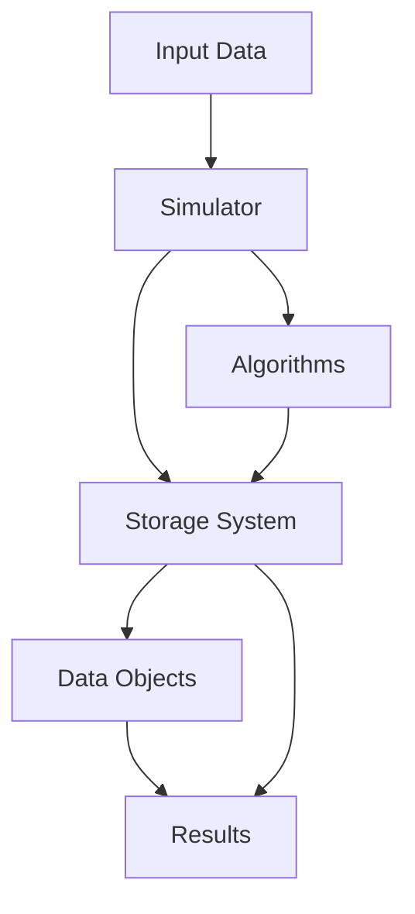

# Architecture

This document describes the architecture of the Optimizing Data Placement system.

## System Overview

The system is designed to simulate and optimize data placement strategies in cloud environments. It consists of several key components that work together to provide a comprehensive simulation environment.

## Core Components

### 1. Simulation Environment (`src/Simulation/`)

- **Simulator**: Main simulation engine that coordinates all components
- **Configuration**: System parameters and settings
- **Result Printer**: Handles output and logging of simulation results

### 2. Storage System (`src/Storage/`)

- Manages data storage and retrieval
- Handles file operations and access patterns
- Implements storage tier management

### 3. Algorithms (`src/Algorithms/`)

- Placement strategies
- Migration policies
- Hotness calculation algorithms
- Reinforcement learning models (DQN, DDQN)

### 4. Data Objects (`src/DataObject/`)

- Data structure definitions
- File metadata management
- Access pattern tracking

## Data Flow

1. **Input Processing**

   - Training data ingestion
   - Access pattern analysis
   - Configuration loading

2. **Simulation Execution**

   - Storage system initialization
   - Algorithm execution
   - Performance metrics collection

3. **Output Generation**
   - Results logging
   - Performance analysis
   - Visualization generation

## Component Interactions

## Key Features

### Storage System

- Multi-tier storage support
- File hotness tracking
- Access pattern analysis
- Network cost consideration

### Algorithms

- Static placement strategies
- Dynamic migration policies
- Reinforcement learning integration
- Performance optimization

### Simulation

- Configurable parameters
- Real-time metrics
- Performance analysis
- Result visualization

## Performance Considerations

- Memory management
- Network latency simulation
- Storage tier optimization
- Access pattern analysis

## Extensibility

The system is designed to be extensible in several ways:

- New placement algorithms can be added
- Custom storage tiers can be implemented
- Additional metrics can be tracked
- New visualization methods can be integrated

## Security

- Data access control
- Secure configuration management
- Safe file operations
- Protected API endpoints
